### Download the virtual box:
##### https://www.virtualbox.org/wiki/Downloads/    

### Download the pfsense ISO: 
##### https://www.pfsense.org/download/

<!-- #### After the download and install virtual box then start the virtual box.

#### Now, we need to create two netwrok WAN and LAN for the pfSense setup.

#### WAN used for the accessing the INTERNET on the pfsence.

#### LAN used for the share the Network connection for the client from the pfSence fierwall. -->

### Here the steps of create the Network birdge on virtual machine.

##### 1). Open the virtual box 
##### 2). Click on Tools.
##### 3). Now, click on Host only Networks 
#####            IPv4: 10.0.0.1/24
#####            Network Mask: 255.255.255.0
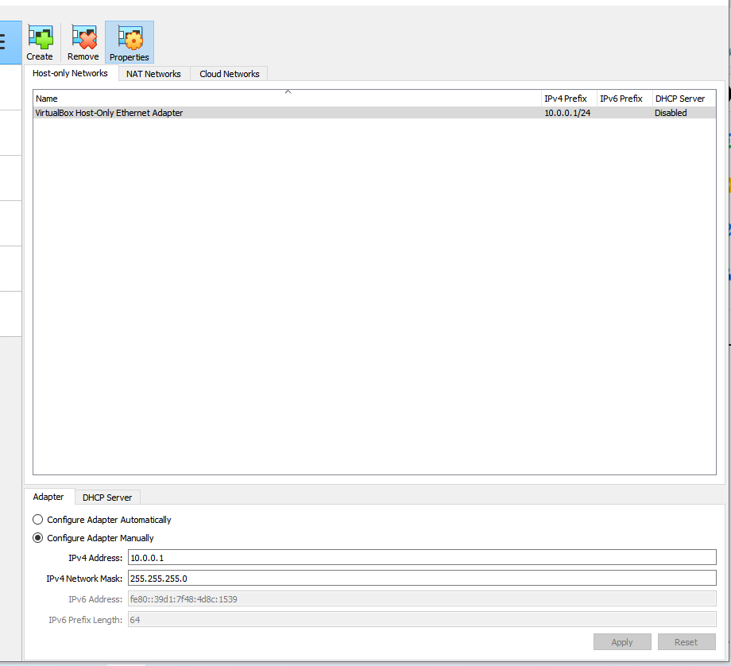
##### 4). Click on Apply.
##### 5). Now, click on NAT Networks.
#####            Name: External
#####            IPv4: 11.0.2.1/24
#####            Disable DHCP
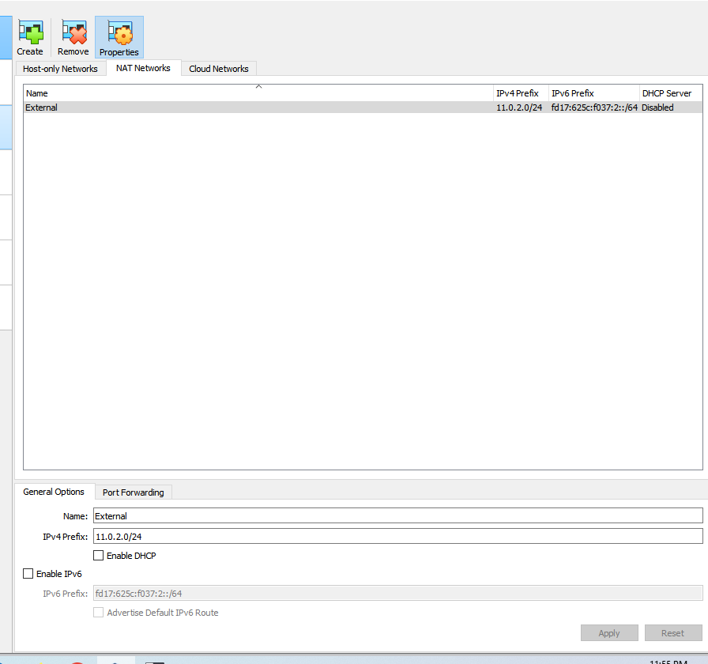

##### 6). Click on Apply.

### Now, Here the steps for setup pfSense firewall on virtual box.

##### 1). Open VirtualBox.
##### 2). Click on the 'New' button.
##### 3). Now, write the name of the machine as 'firewall'.
##### 4). Select the pfSense ISO.
##### 5). Choose the type as 'BSD'.
##### 6). Select version 'OpenBSD (64-bit)'.
##### 7). Click on the next button.
##### 8). Now, allocate the base memory and CPU in the hardware settings.
##### 9). Click on the next button.
##### 10). Select the virtual hard disk.
##### 11). Click on the next button.
##### 12). Finally, click on the Finish button.

 ### Now, select Network for pfSense firewall setup.

##### 1). Click on the settings of the firewall machine.
##### 2). Click on Network.
##### 3). Now, click on Adapter 1.
##### 4). Enable Network Adapter and select NAT Network (WAN).
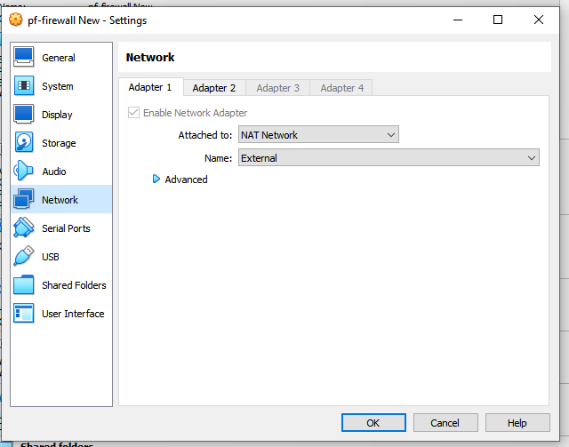
##### 5). Then, click on Adapter 2.
##### 6). Enable Host-only Adapter and select 
##### 7). VirtualBox Host-Only Ethernet Adapter (LAN).
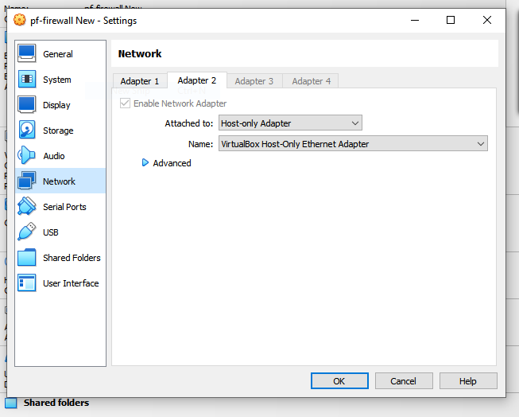

##### 8). Click on the OK button.

### . Here the steps of LAN network on pfsense.

##### 1). Screen of pfsense.

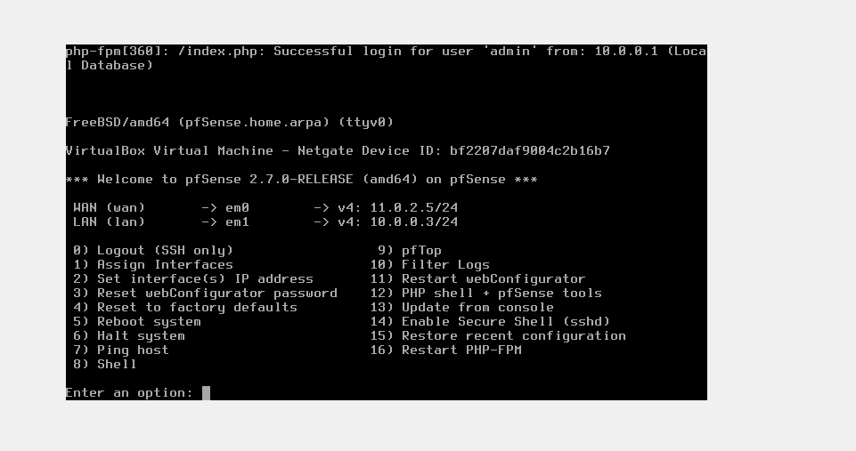

##### 2). Now, select option 2

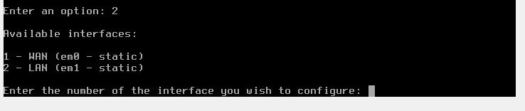

##### 3). Now, select option 2 for LAN
##### 4). Then, LAN interface via DHCP: N
##### 5). Then, Enter the LAN address: 10.0.0.3
##### 6). Then, Select the subnet: 24
##### 7). Then, enter the LAN gateway:  

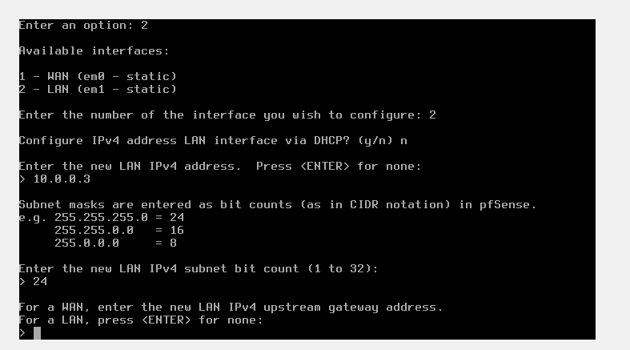

##### 8). Now, gateway set asdefault: N
##### 9). Now, IPv6 address: N
##### 10).Now, Enable the DHCP server on LAN:Y
##### 11). Now, Enter the start address of the IPv4 client. address range: 10.0.0.11
##### 12). Now, Enter the end address of the IPv4 client address range: 10.0.0.50

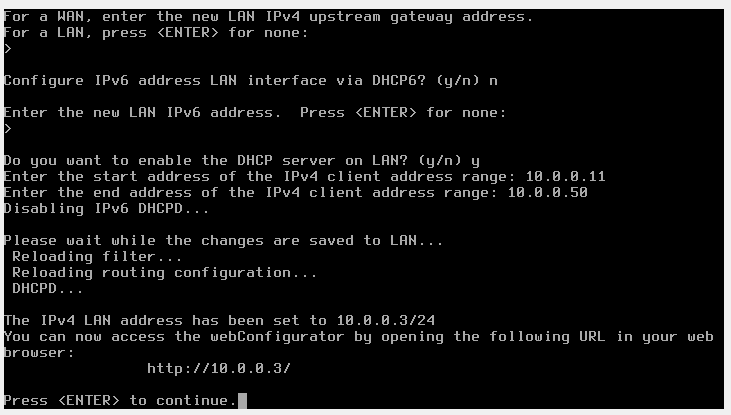

### Now, Access the dasbord of pfSenace on browers IP: 10.0.0.3
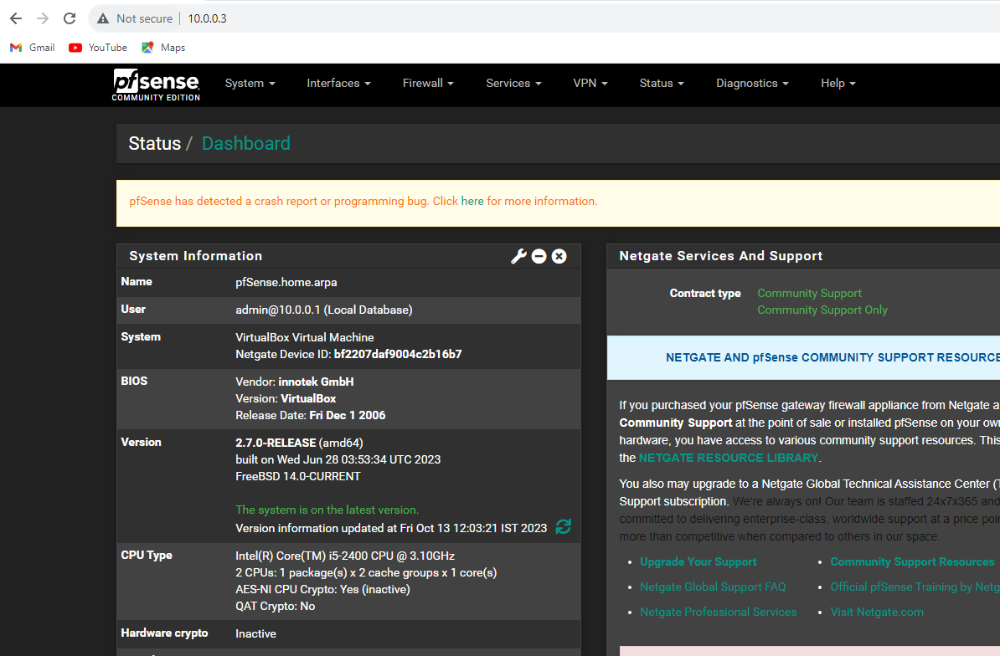
###  Here the steps of WAN network on pfsense
##### 1). Now, select option 2
##### 2). Now, select option 1 for WAN
##### 3). Then, WAN interface via DHCP: N
##### 4). Then, Enter the WAN address: 11.0.2.5
##### 5). Then, Select the subnet: 24
##### 6). Then, enter the WAN gateway: 11.0.2.1
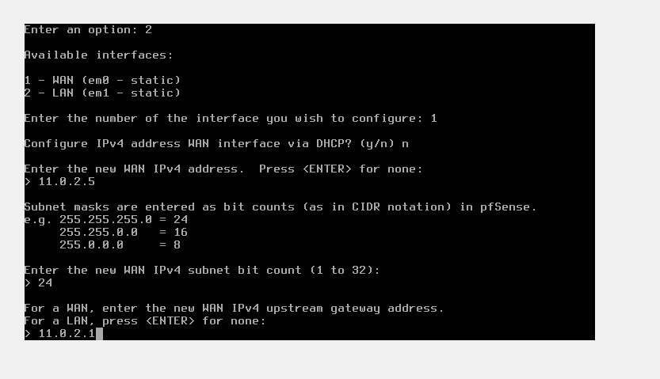
##### 7). Now, gateway set asdefault: N
##### 8). Now, IPv6 address: N
##### 9).Now, Enable the DHCP server on WAN: N 

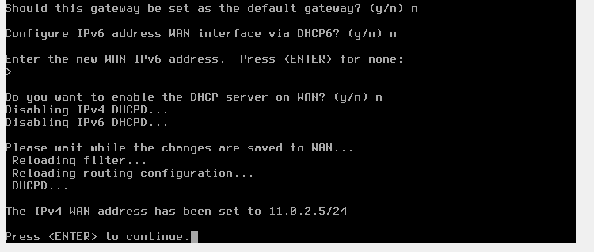
### Now, let's check the Internet working on pfsense.
##### ping google.com
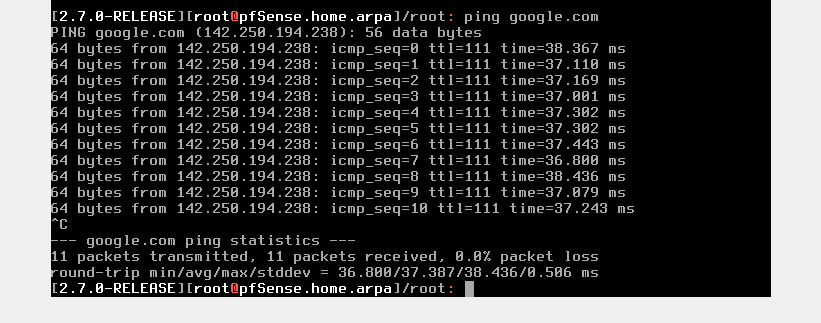

